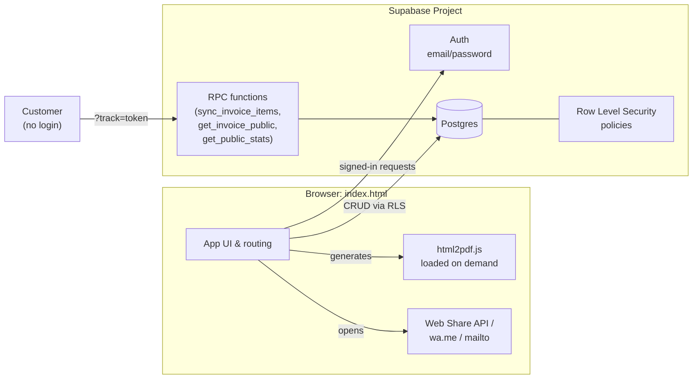

# Yawee Foods: Wholesale Business Manager


A single-file invoicing and business management app built for **Yawee Foods Limited**, a wholesale African and Caribbean grocery distributor based in Colchester, Essex. It handles the day-to-day of running the business: raising invoices, tracking stock, recording payments (including split/partial payments), following up on customers, and reporting on revenue, without needing a server to deploy or maintain.

> Built as a real production tool for the business, and as a portfolio piece demonstrating a full client-side app backed by a properly secured Postgres database.

---

## Table of contents

- [Features](#features)
- [Tech stack](#tech-stack)
- [Architecture](#architecture)
- [Getting started](#getting-started)
- [Project structure](#project-structure)
- [Security model](#security-model)
- [Known limitations](#known-limitations)
- [Roadmap](#roadmap)
- [License](#license)

---

## Features

**Invoicing**
- Create, edit, and delete invoices with multiple line items
- Pick products from the catalogue (auto-fills price, unit, and description) or add a custom item, which is automatically saved as a new product for later editing
- Delivery fee and tax handling, with totals laid out like a professional printed invoice
- Manual status control (Draft / Sent / Paid / Cancelled), with Overdue detected automatically
- Download a real PDF, generated entirely in the browser, no server round-trip
- Share an invoice via WhatsApp or email with an editable custom message; where the browser supports it, the actual PDF file attaches natively through the OS share sheet
- A unique, login-free tracking link per invoice that customers can open to view it, automatically marked "Viewed" and showing a full payment breakdown for complete transparency

**Stock**
- Product catalogue with price, unit of sale (box, case, bag, etc.), and stock level
- Stock automatically decreases when an invoice is created and adjusts correctly on edits and deletes
- Live "X left after this invoice" preview while building an invoice, with correct pluralisation (1 box / 3 boxes)

**Payments**
- Record partial and split payments against a single invoice (e.g. £200 by cash today, £300 by bank transfer next week); balances update automatically as each payment lands
- Edit or delete a recorded payment if a mistake was made
- Payment and invoice history grouped by customer, one click to see everything for a given account

**Reporting**
- Revenue chart, top customers, and top products, filterable by date range (30 days, 3/6/12 months, this year, all time, or a custom range)
- One-click CSV export of the full customer-revenue and product-revenue reports (not just the top 5 shown on screen) for further analysis in Excel or Sheets

**Accounts & access**
- Email/password authentication with a proper password reset flow
- Row Level Security ensures each account only ever sees its own data

---

## Tech stack

| Layer | Choice |
|---|---|
| Frontend | Vanilla HTML, CSS, and JavaScript: a single `index.html` file |
| Backend | [Supabase](https://supabase.com): Postgres database, Auth, Row Level Security, and RPC functions |
| PDF generation | [html2pdf.js](https://github.com/eKoopmans/html2pdf.js) (loaded on demand, not on every page visit) |
| Icons | [Feather Icons](https://feathericons.com) |
| Fonts | Space Grotesk, Inter, and JetBrains Mono via Google Fonts |
| Hosting | Any static host, deployed on GitHub Pages |

No build step, no bundler, no `node_modules`. Everything the browser needs is either inlined or loaded from a CDN.

---

## Architecture



The app is entirely client-driven. There is no custom backend server: Supabase's Postgres database, authentication, and Row Level Security do the work a traditional API layer would otherwise handle. The only backend logic beyond RLS lives in three small Postgres functions (see `schema.sql`):

- `sync_invoice_items`: replaces an invoice's line items atomically, so a failed write can never leave items deleted without their replacement landing
- `get_invoice_public` / `mark_invoice_viewed`: power the login-free customer tracking link, returning only that one invoice's data
- `get_public_stats`: returns aggregate counts (not data) for the login screen

---

## Getting started

1. **Create a Supabase project** at [supabase.com](https://supabase.com) (the free tier is sufficient).
2. **Run the schema**: open the SQL Editor in your Supabase project and run the full contents of [`schema.sql`](./schema.sql). It's idempotent, safe to re-run after future updates.
3. **Get your project keys**: in Supabase, go to Settings → API and copy your Project URL and Publishable (anon) key.
4. **Configure the app**: open `index.html` and paste your keys in at the top:
   ```js
   const SUPABASE_URL = "https://your-project-ref.supabase.co";
   const SUPABASE_ANON_KEY = "sb_publishable_...";
   ```
5. **Deploy**: push `index.html` to a GitHub repo and enable GitHub Pages (Settings → Pages), or host it on any static file host. No build step required.
6. **(Optional) Set up email delivery**: Supabase's built-in mailer is rate-limited and intended for testing only. For reliable signup confirmation and password reset emails, connect a custom SMTP provider (e.g. [Resend](https://resend.com)) under Project Settings → Authentication → SMTP Settings.

---

## Project structure

```
.
├── index.html      # The entire application: UI, logic, and styling
└── schema.sql       # Database schema, RLS policies, and RPC functions
```

---

## Security model

- The **Publishable (anon) key** embedded in `index.html` is safe to expose publicly, it's designed to be, and it's protected by Row Level Security rather than secrecy. It's fine for this file to live in a public GitHub repo.
- Every table has RLS enabled, scoped to `owner_id = auth.uid()`, so one account can never read or modify another's data.
- The public invoice tracking link deliberately bypasses login, but only through two narrow, `security definer` RPC functions that return a single invoice's data by an unguessable UUID token, never a general query surface.
- **Never** commit a Supabase **service role / secret key**, a database password, or any third-party API key (Resend, Twilio, etc.) into this repository. Those belong only in server-side secrets (e.g. Supabase Edge Function secrets), never in client-side code.

---

## Known limitations

- **Single-tenant per account**: each signed-up account currently sees only its own, separate set of data. Multiple staff sharing one business's data would need an additional `businesses`/`memberships` layer, not yet built.
- **PDF generation is client-side**: it depends on the browser's rendering engine and network connection at the moment of generation; very large invoices generate a taller single-page PDF rather than paginating across multiple pages.
- **No built-in transactional email service**: password reset and (if re-enabled) signup confirmation emails depend on Supabase's default mailer unless custom SMTP is configured.

## Roadmap

- [ ] Multi-user shared business accounts with roles
- [ ] Recurring/scheduled invoices
- [ ] Inline low-stock and overdue-invoice email digests

---

## License

MIT, see [LICENSE](./LICENSE) for details. Adjust as appropriate before publishing if you'd prefer to keep this private or apply different terms.

---

<p align="center">Built for Yawee Foods Limited, Colchester.</p>
