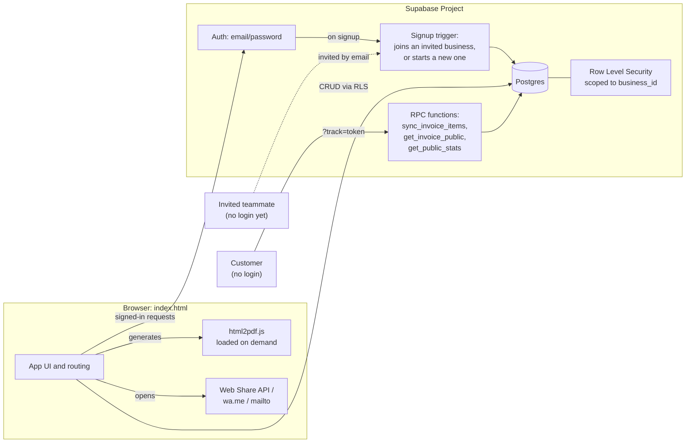

# Yawee Foods: Wholesale Business Manager


A single-file invoicing and business management app built for **Yawee Foods Limited**, a wholesale African and Caribbean grocery distributor based in Colchester, Essex. It handles the day-to-day of running the business: raising invoices, tracking stock, recording payments, following up on customers, and reporting on revenue, shared across everyone on the team, with every action attributed to whoever did it.

> Built as a real production tool for the business, and as a portfolio piece demonstrating a full client-side app backed by a properly secured, multi-user Postgres database.

---

## Table of contents

- [Features](#features)
- [Tech stack](#tech-stack)
- [Architecture](#architecture)
- [Getting started](#getting-started)
- [Project structure](#project-structure)
- [Security model](#security-model)
- [Known limitations](#known-limitations)
- [Roadmap](#roadmap)
- [License](#license)

---

## Features

**Invoicing**
- Create, edit, and delete invoices with multiple line items, laid out as a card per item rather than a cramped table, so it works cleanly on a phone
- Pick products from the catalogue (autofills price, unit, and description) or add a custom item, which is automatically saved as a new product for later editing
- Delivery fee and tax handling, with totals laid out like a professional printed invoice
- A live stock preview while building an invoice ("42 bags in stock, 39 left after this invoice"), with the remaining count highlighted in red once it drops
- Manual status control (Draft, Sent, Paid, Cancelled), with Overdue detected automatically once a Sent invoice passes its due date
- A detailed edit history on every invoice: not just "edited this," but exactly what changed ("Delivery fee changed from £0.00 to £20.00; Ijebu Garri 10kg quantity changed from 10 to 15")
- Download a real PDF, generated entirely in the browser inside an isolated frame so it renders identically on mobile and desktop
- Share an invoice via WhatsApp or email with an editable custom message. Where the browser supports it, the actual PDF file attaches natively through the device's own share sheet
- A unique, login-free tracking link per invoice that customers can open to view it, automatically marked "Viewed," showing a full payment breakdown, optional bank payment details, and a "Received by" signing section for delivery confirmation

**Stock and inventory**
- A full audit trail: every stock change, whether from a sale, a manual restock, a correction, or a write-off, is permanently logged with a reason, an optional note, and the resulting balance
- Per-product reorder points, with low-stock items automatically sorted to the top of the Products page and flagged with a pulsing red badge
- A one-tap "Notify manager" button that composes a WhatsApp message listing everything currently low on stock
- Inventory analytics in Reports: current stock value, what needs reordering, fastest-moving products by actual quantity sold, and slow or dead stock showing capital tied up in things that haven't sold

**Payments**
- Record partial and split payments against a single invoice (part cash today, part bank transfer next week), with the balance updating automatically as each payment lands
- Edit or delete a recorded payment if a mistake was made
- Payment and invoice history grouped by customer, one click to see everything for a given account

**Team and accountability**
- Everyone who logs in, owner, manager, or staff, sees the exact same shared data. Nothing is split into separate silos per person
- Invite a teammate by email from Settings, they land in your business automatically the moment they sign up with that address
- A full Activity feed: who created, edited, deleted, or changed the status of what, and exactly when, filterable by type
- The activity log is insert-only from the client. Only the business owner can clear it, and only as part of a full data reset, so it can't be quietly edited to hide what happened

**Reporting**
- Revenue chart, top customers, and top products, filterable by date range (30 days, 3 or 6 or 12 months, this year, all time, or a custom range)
- One-click CSV export of the full customer-revenue, product-revenue, and inventory-valuation reports, not just the top 5 shown on screen, for further analysis in Excel or Sheets

**Accounts and access**
- Email and password authentication with a proper password reset flow
- Row Level Security scoped to the shared business, not the individual account

---

## Tech stack

| Layer | Choice |
|---|---|
| Frontend | Vanilla HTML, CSS, and JavaScript: a single `index.html` file |
| Backend | [Supabase](https://supabase.com): Postgres database, Auth, Row Level Security, and RPC functions |
| PDF generation | [html2pdf.js](https://github.com/eKoopmans/html2pdf.js), loaded on demand only when a PDF is actually requested, not on every page visit |
| Icons | [Feather Icons](https://feathericons.com) |
| Fonts | Space Grotesk, Inter, and JetBrains Mono via Google Fonts |
| Hosting | Any static host, deployed on GitHub Pages |

No build step, no bundler, no `node_modules`. Everything the browser needs is either inlined or loaded from a CDN.

---

## Architecture



The app is entirely client-driven. There is no custom backend server: Supabase's Postgres database, authentication, and Row Level Security do the work a traditional API layer would otherwise handle. The backend logic beyond RLS lives in a handful of small Postgres functions and one trigger (see `schema.sql`):

- `handle_new_user` (trigger on signup): joins an existing business if the person's email was invited beforehand, otherwise starts a brand new business with them as its owner
- `sync_invoice_items`: replaces an invoice's line items atomically, so a failed write can never leave items deleted without their replacement landing
- `get_invoice_public` and `mark_invoice_viewed`: power the login-free customer tracking link, returning only that one invoice's data by an unguessable token
- `get_public_stats`: returns aggregate counts, not data, for the login screen
- `is_business_member` and `is_business_owner`: used throughout the RLS policies to check shared-business access without risking policy recursion

---

## Getting started

1. **Create a Supabase project** at [supabase.com](https://supabase.com), the free tier is sufficient to start.
2. **Run the schema**: open the SQL Editor in your Supabase project and run the full contents of [`schema.sql`](./schema.sql). It's written to be safe to re-run any number of times.
3. **Get your project keys**: in Supabase, go to Settings, then API, and copy your Project URL and Publishable (anon) key.
4. **Configure the app**: open `index.html` and paste your keys in at the top:
   ```js
   const SUPABASE_URL = "https://your-project-ref.supabase.co";
   const SUPABASE_ANON_KEY = "sb_publishable_...";
   ```
5. **Deploy**: push `index.html` to a GitHub repo and enable GitHub Pages (Settings, then Pages), or host it on any static file host. No build step required.
6. **Set the Site URL**: in Supabase, go to Authentication, then URL Configuration, and set both Site URL and Redirect URLs to your deployed address (for example `https://yourname.github.io/your-repo/`). This is what confirmation and password reset emails link back to.
7. **Set up email delivery**: Supabase's built-in mailer is rate-limited and intended for testing only. For reliable signup confirmation and password reset emails, connect a custom SMTP provider (for example [Resend](https://resend.com)) under Project Settings, then Authentication, then SMTP Settings.

---

## Project structure

```
.
├── index.html      # The entire application: UI, logic, and styling
└── schema.sql       # Database schema, RLS policies, and RPC functions
```

---

## Security model

- The **Publishable (anon) key** embedded in `index.html` is safe to expose publicly, it's designed to be, and it's protected by Row Level Security rather than secrecy. It's fine for this file to live in a public GitHub repo.
- Every table has RLS enabled, scoped to shared business membership rather than the individual account, so anyone on the team sees the same data, and no one outside the business can see any of it.
- The Activity log accepts inserts and reads from any team member, but deletion is restricted to the business owner and only happens as part of a full reset, keeping the audit trail meaningfully tamper-resistant.
- The public invoice tracking link deliberately bypasses login, but only through two narrow, security-definer RPC functions that return a single invoice's data by an unguessable UUID token, never a general query surface.
- **Never** commit a Supabase service role or secret key, a database password, or any third-party API key into this repository. Those never belong in client-side code.

---

## Known limitations

- **PDF generation is client-side**: it depends on the browser's rendering engine and network connection at the moment of generation. Very long invoices generate a single tall page rather than paginating across multiple pages.
- **No built-in transactional email service**: password reset and signup confirmation emails depend on Supabase's default mailer unless custom SMTP is configured, and that default mailer is rate-limited.
- **Sharing a real PDF file (not just a link) via WhatsApp or email depends on the Web Share API**, which most mobile browsers support but most desktop browsers do not. On desktop, the fallback downloads the PDF and opens the message separately, with a reminder to attach it manually.
- **Team invites require the invited person to sign up with the exact email address invited**, in the correct order (invite first, then sign up). Signing up first and being invited afterward starts a separate business by default.

## Roadmap

- [ ] Recurring or scheduled invoices
- [ ] Inline low-stock and overdue-invoice email digests
- [ ] Role-based permission restrictions beyond the current owner/manager/staff labels

---

## License

MIT, see [LICENSE](./LICENSE) for details. Adjust as appropriate before publishing if you'd prefer to keep this private or apply different terms.

---

<p align="center">Built for Yawee Foods Limited, Colchester.</p>
